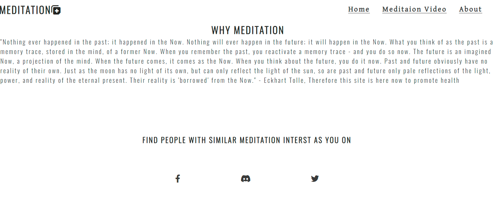

# Meditation website
Welcome! [Meditation](https://awsomenesss.github.io/Project-1/)
## Introduction
meditation website is a website that aim to provide details on the impotrtace of meditation.

The overall aim of this project is to make online the componennt "coagulation" which I involve for teaching. 

A live website can be found [here]

## Table of Contents 

# Table of Contents
 [1. User Expereince (UX) design](#ux)
  - [User Goals:](#user-goals)
  - [User Expectations:](#user-expectations)
  
  

      
  [2. Features](#features)

  [3.Technologies used](#technologies-used)

  [4.Testing](#testing)

  [5.Bugs](#bugs)

  [6. Deployment](#deployment)

  [7. Acknowledgement](#acknowledgement)

  
# 1. User Expereince (UX) design
  [Go to the top](#table-of-contents)

This project is aimed to provide a platform to encorage people to take an interest in meditation.

  The following users types can be benifitted from the website:

* people who want to know the benifits of meditation.

 

## 1.1 User Goals
  [Go to the top](#table-of-contents)

The main goal of this website is to provide an encoragement to users and provide guide videos, websites and papers on the importance of meditation.

## 1.2 User Expectations
  [Go to the top](#table-of-contents)

The website is focused to encorage peoplewho are new to meditation.
* The site structure is designed considering the expectation of users to be simple and easy to use.
* The user interface is easy to navigate (inlcude main navigation bar, link to website and papers on the benefits of meditation).

# 2. Features
  [Go to the top](#table-of-contents)
 ### All 3 pages:
- Navigation bar is placed at the top right corner of the page, and cosnidered a hover effect that changes.The hover effect is placed to improve the user expereince. 

- Background image of a meditating person color were chosen considering the contrast between background and foreground colours. 
- Social media links (for facebook, discord and Twitter) are placed at the bottom of the each page in the footer. All the links will open in a new tab. 

### Home page:
- pictue of meditation person as background picture.
- The page contain the title of the module "meditation".
- An external link provided users wth external research papers and websits link.

The screenshot of home page is below:

  Introduction page UI:
  

### guided meditation page:
- This page provides vidios for differnt medtation technique.

The screenshot of theory page is below:

 video page UI:
  

### about page:
- Include motivational paragraph.
- social linkd for meeting like minded people.

  About page UI:
  

# 3. Technologies Used
  [Go to the top](#table-of-contents)

* [HTML5](https://en.wikipedia.org/wiki/HTML5) (markup language) was used for structuring and presenting content of the website.
* [CSS3](https://en.wikipedia.org/wiki/CSS) (Cascading Style Sheets) was used to provide the style to the content written in a HTML.
* [Google Fonts](https://fonts.google.com/) was used to import font-family "Lato" and "Oswald" into style,css file and which was used throughout the pages of the website.
* [Font Awesome](https://fontawesome.com/) was used to improt icons to the sites.
* [Chrome](https://www.google.com/intl/en_uk/chrome/) was used to debug and test the source code using HTML5 as well as to test site responsiveness.
* [Github](https://github.com/) was used to create the repository and to store the cproject's code after pushed from Git.
* [Gitpod](https://www.gitpod.io/) was used as the Code Editor for the site

# 4. Testing
  [Go to the top](#table-of-contents)
For every element that I added to my HTML, I would add the basic CSS to my stylesheet. I would then use the inspect element to try different styles. Once I've got it to my liking I would copy the CSS from google into my stylesheet. This allows me to keep track of the code I am using.

### Responsive Tools

I used [Am I Responsive](http://ami.responsivedesign.is/) to make sure that all my pages are responsive to all devices.

### W3C Validator Tools

I used [W3C Markup](https://validator.w3.org/#validate_by_input+with_options) to check for any errors within my HTML pages.

I had an error on the index.html page with the iframe attribute of "frameborder". The HTML checker notified me that this attribute is obsolete and to use CSS instead.

I also had an error on the contact_us.html page with a duplicate ID of "form_inline". I rectified this by changing the ID's to a class instead and updated the CSS for this.

I used [W3C CSS Validation](https://jigsaw.w3.org/css-validator/) to check for any error within my CSS stylesheet.

# 6. Deployment
  [Go to the top](#table-of-contents)

I used GitHub pages to deploy my final project. To do this I had to:

 Create a repository on GitHub.

  
# 7. Acknowledgement
  [Go to the top](#table-of-contents)
### Code
* The main code came from the Love Running project.
* The code for read more button on index.html page came from stackoverflow.

### Content 
* The icons in the footer and contact page came from [Font Awesome](https://fontawesome.com/)
 * All the contents for index.html page age came from [goolgle](https://www.google.com)
 * The images from  [Google Images](https://www.google.com/imghp?hl=en)

